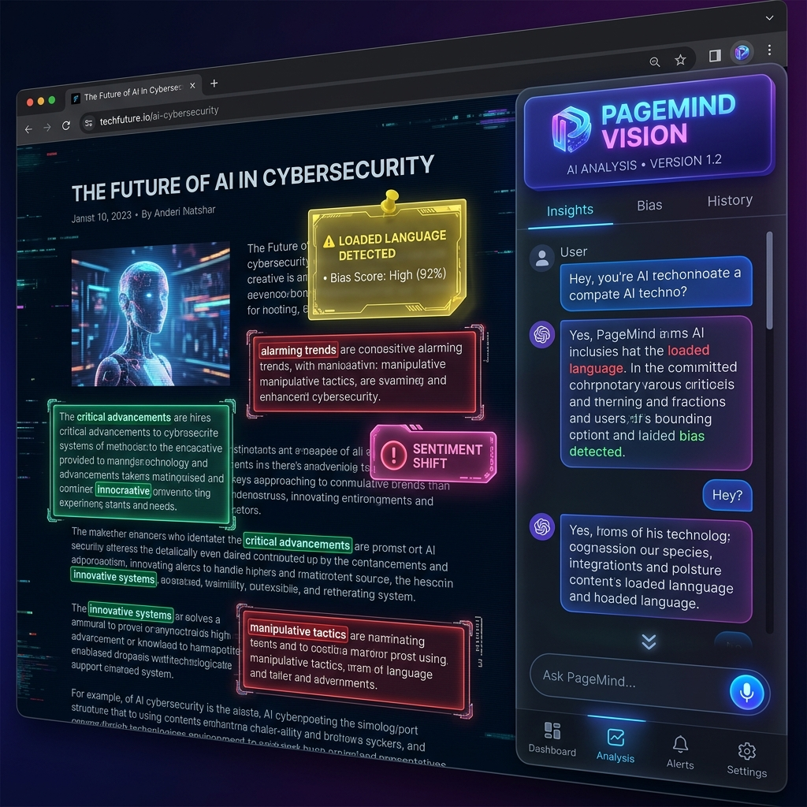
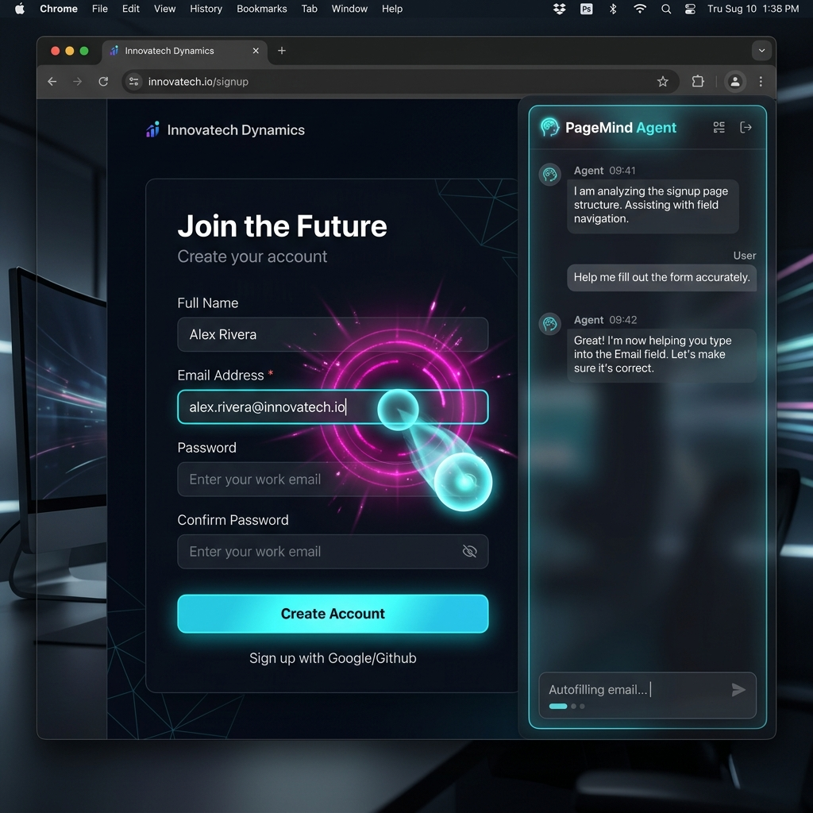
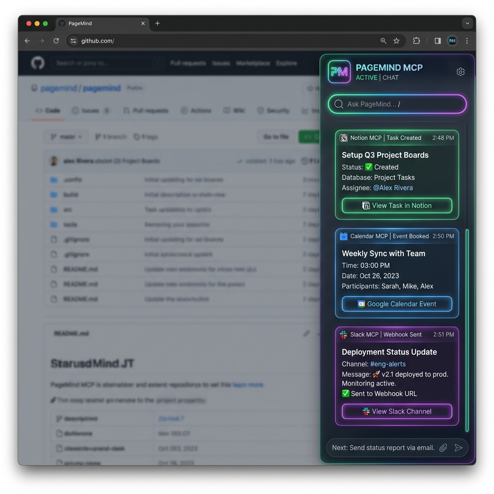

# PageMind-AI-generic-sidebar

> **The 2026 AI Browser Copilot that sees, clicks, annotates, and controls your tools directly on any webpage.**

---

## 📸 Extension Screenshots & Feature Showcase

### 🥇 1. PageMind Vision — Live Webpage 3D Annotations
Instead of just chatting in a sidebar, PageMind **physically draws on the live webpage**. It renders 3D glowing bounding boxes with tech corner brackets, pin-drops translucent 3D sticky notes, highlights text, and attaches status badges directly over DOM elements.



---

### 🥈 2. PageMind Agent — Interactive Form Automation & 3D Ghost Laser Cursor
Give your AI hands. PageMind Agent moves a glowing **3D Laser Orb Ghost Cursor** with 60fps spring motion physics across your screen, scrolls to elements, clicks buttons with ripple effects, and performs character-by-character form field typing with native Web Audio API sound FX.



---

### 🥉 3. PageMind MCP Router — Connected Tools Hub (Notion, Calendar, GitHub, Slack)
Execute external service tasks from any webpage using the **Model Context Protocol (MCP)**. PageMind automatically creates Notion database items, generates Google Calendar links & downloadable `.ics` calendar files, logs GitHub issues, and posts rich Slack webhook notifications with interactive tool cards in the chat stream.



---

## 📖 How to Install & Use (Step-by-Step)

### 📥 Step 1: Download the Extension Code
1. Click the **Code** button at the top of this repository and select **Download ZIP**.
2. Extract the downloaded ZIP file to a folder on your computer (or run `git clone https://github.com/Sriram-J-CS/PageMind-AI-generic-sidebar.git`).

---

### 🔌 Step 2: Load Extension into Google Chrome
1. Open Google Chrome and type `chrome://extensions` in the address bar.
2. Enable **Developer mode** using the toggle switch in the top-right corner.
3. Click **Load unpacked** (top-left button).
4. Select the `PageMind-AI-generic-sidebar` folder.

---

### ⚙️ Step 3: Configure Settings & API Keys
1. Click the **PageMind icon** in your Chrome extension toolbar.
2. Enter your **OpenAI API Key** (`sk-...`).
3. *(Optional)* Click **Advanced MCP Integrations** to add your Notion Token, Notion Database ID, GitHub Token, or Slack Webhook URL.
4. Click **✨ Save Settings & Activate**.
5. Click **🧪 Test OpenAI Connection** to verify your key.

> **💡 Instant Demo Mode:** Don't have an API key ready? PageMind features smart built-in demo fallback modes for Vision, Agent, and MCP so you can test all features immediately without any setup!

---

## 🎮 How to Trigger & Operate PageMind

You can activate PageMind on **any webpage** using any of these 4 convenient methods:

1. **Floating 3D Orb Widget:** Click the glowing 🔮 orb anchored at the bottom-right corner of any webpage.
2. **Keyboard Shortcuts:**
   - <kbd>Alt</kbd> + <kbd>P</kbd> — Toggle 3D PageMind Sidebar
   - <kbd>Alt</kbd> + <kbd>V</kbd> — Launch 3D Vision Annotator
   - <kbd>Alt</kbd> + <kbd>A</kbd> — Launch Agent Laser Cursor Mode
3. **Right-Click Context Menu:** Select text on any webpage ➔ Right-click ➔ Choose **"🎯 Annotate with PageMind Vision"** or **"🤖 Control with PageMind Agent"**.
4. **Extension Popup:** Click the **⚡ Open** button inside the extension popup window.

---

## 📁 Repository Structure

```
PageMind-AI-generic-sidebar/
├── manifest.json       # Chrome Extension Manifest V3
├── popup.html          # 3D Glassmorphic Settings Control Center
├── popup.js            # Settings sync & OpenAI connectivity test logic
├── styles.css          # 3D Design system, floating orb, overlays & animations
├── content.js          # Core engine: Vision, Agent, MCP Router, Web Audio FX
├── background.js       # Service worker & context menu shortcuts
├── generate_icons.js   # Icon builder script
├── icon16.png          # 16x16 Extension Icon
├── icon48.png          # 48x48 Extension Icon
├── icon128.png         # 128x128 Extension Icon
├── assets/             # Screenshots showcasing Vision, Agent & MCP UI
│   ├── vision_mode.png
│   ├── agent_mode.png
│   └── mcp_mode.png
├── LICENSE             # MIT Open Source License
└── README.md           # Documentation & instructions
```

---

## 🛠️ Tech Stack & Design Architecture

- **Manifest Version:** Chrome Extension V3
- **Styling:** Vanilla CSS3 3D Glassmorphism (`backdrop-filter: blur(28px)`), Neon Accents & Keyframe Animations
- **Engine:** Pure JavaScript (ES2026) with DOM Node TreeWalker position calculation engine
- **Audio:** Web Audio API Frequency Oscillator Synth
- **Protocol:** Model Context Protocol (MCP) Router

---

## 📜 License

This project is open-source under the **MIT License** — free to use, modify, and distribute.
